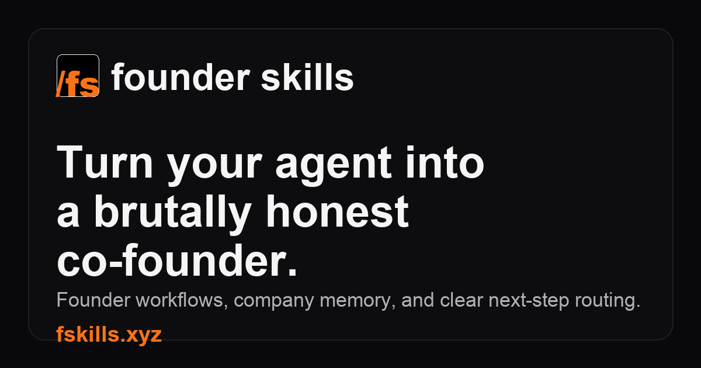

# Founder Skill Pack



**24 agent skills for non-technical founders building world-class products.**

Skills for pi, Claude Code, and Codex. Every skill produces a concrete `.md` artifact — not option lists, not framework overviews. Opinionated decisions, worked examples, and a clear next step.

---

## The Journey

The skills map to six phases of building a product:

```
Strategy → Design → Build → Launch → Compound → PMF
```

You don't need all 24. Start where you are.

---

## Skills

### Strategy — Validate before you build

| Skill | What it produces | Invoke with |
|-------|-----------------|-------------|
| `mvp-scoper` | `mvp-brief.md` — scoped MVP with 3 must-have features | "Scope my MVP" |
| `problem-validator` | `problem-validation.md` — evidence the problem is real | "Validate my problem" |
| `customer-hypothesis` | `customer-profile.md` — specific customer portrait | "Define my customer" |
| `assumption-mapper` | `assumptions-map.md` — ranked risky bets with cheap tests | "Map my assumptions" |

### Design — UX before UI

| Skill | What it produces | Invoke with |
|-------|-----------------|-------------|
| `ux-flow-designer` | `user-flows.md` — 3 core flows mapped step by step | "Design my user flows" |
| `design-direction-setter` | `design-direction.md` — visual vocabulary and moodboard brief | "Set my design direction" |
| `ux-heuristics-reviewer` | `ux-review.md` — 10 heuristics scored with fixes | "Review my UX" |

### Build — Decisions, not debates

| Skill | What it produces | Invoke with |
|-------|-----------------|-------------|
| `stack-selector` | `stack-decision.md` — specific tech stack with rationale | "Pick my stack" |
| `feature-sequencer` | `feature-sequence.md` — ordered build sequence | "Sequence my features" |
| `integration-picker` | `integrations.md` — specific tools per job-to-be-done | "Pick my integrations" |
| `architecture-explainer` | `architecture.md` — system explained in plain English | "Explain my architecture" |

### Launch — Ship with confidence

| Skill | What it produces | Invoke with |
|-------|-----------------|-------------|
| `positioning-writer` | `positioning.md` — one-liner, elevator pitch, tagline | "Write my positioning" |
| `landing-page-copywriter` | `landing-page.md` — full landing page copy | "Write my landing page" |
| `launch-plan-builder` | `launch-plan.md` — week-by-week plan across 3 channels | "Build my launch plan" |
| `pricing-model-framer` | `pricing.md` — pricing model with rationale | "Frame my pricing" |

### Compound — The recurring ritual

| Skill | What it produces | Invoke with |
|-------|-----------------|-------------|
| `build-cycle` | `cycles/YYYY-MM-DD.md` — cycle record with MPP + PMF signal | "Start a build cycle" |
| `mpp-evaluator` | `mpp-scorecard.md` — Minimum Proud Product score across 5 criteria | "Evaluate my MPP" |
| `failure-navigator` | `diagnosis.md` — root cause of stagnation + pivot prescription | "Help me through a failure" |

### PMF — Find and amplify what's working

| Skill | What it produces | Invoke with |
|-------|-----------------|-------------|
| `pmf-signal-reader` | `pmf-assessment.md` — signal strength across retention/WoM/engagement/revenue | "Read my PMF signals" |
| `north-star-definer` | `north-star.md` — the one metric to obsess over | "Define my north star" |
| `retention-loop-designer` | `retention-loop.md` — complete Hook Canvas design | "Design my retention loop" |
| `growth-loop-builder` | `growth-loop.md` — self-reinforcing growth mechanism | "Build my growth loop" |
| `churn-diagnostician` | `churn-diagnosis.md` — root cause + specific experiment | "Diagnose my churn" |

### Partner — Your co-founder in a skill

| Skill | What it produces | Invoke with |
|-------|-----------------|-------------|
| `founder-partner` | Updated `founder-context.md` + direction for the session | "Partner" or "Check in with my partner" |

---

## Install

```bash
git clone https://github.com/gvkhosla/founder-skill-pack.git
cd founder-skill-pack
```

**For pi:**
```bash
bash scripts/install.sh pi
```

**For Claude Code (global):**
```bash
bash scripts/install.sh claude
```

**For Claude Code (project only):**
```bash
bash scripts/install.sh claude .
```

**For Codex:**
```bash
bash scripts/install.sh codex
# then add skills/codex/AGENTS.md contents to your project's AGENTS.md
```

**Install a single phase:**
```bash
bash scripts/install.sh pi strategy
bash scripts/install.sh claude pmf
```

---

## How Skills Work

Every skill is a `SKILL.md` file. Each file contains:

1. **What you'll get** — the exact output artifact
2. **How it works** — step-by-step process the agent follows
3. **Parallel execution** (where applicable) — independent workstreams run simultaneously
4. **Worked example** — a real scenario showing inputs and outputs
5. **Related skills** — what to use before and after

Skills are self-contained. No internet required. No API keys. No setup beyond installing the files.

---

## Multi-Agent

Skills with independent workstreams spawn parallel subagents. pi and Claude Code execute this natively. Codex runs the same steps sequentially (every parallelized skill includes a Sequential Fallback section).

**Skills with parallel execution:**
- `assumption-mapper` — N agents, one per assumption
- `mpp-evaluator` — 5 agents, one per MPP criterion
- `failure-navigator` — 5 agents, one per failure hypothesis
- `build-cycle` (Phase 3) — 3 agents for scoring and pattern reading
- `launch-plan-builder` — 3 agents for Owned/Rented/Borrowed channels
- `pmf-signal-reader` — 4 agents for retention/WoM/engagement/revenue
- `north-star-definer` — N agents, one per candidate metric
- `retention-loop-designer` — 4 agents for Trigger/Action/Reward/Investment
- `growth-loop-builder` — 4 agents for viral/content/product/sales loops
- `churn-diagnostician` — 3 agents for timing/behavior/feedback

---

## The `founder-context.md` Convention

The `founder-partner` skill keeps a persistent memory of your product's story in `founder-context.md` at your project root.

Every skill that benefits from context will read this file if it exists. Create yours from the template:

```bash
cp skills/partner/founder-partner/context-template.md [your-project-root]/founder-context.md
```

Then run a `founder-partner` session to fill it in.

---

## Philosophy

**Opinionated, not comprehensive.** Every skill makes a recommendation — not a menu of options. You can disagree. But you'll have to think to disagree.

**Artifacts, not advice.** Every skill produces a `.md` file. You can read it, share it, argue with it, update it, and use it with the next skill.

**The MPP, not the MVP.** Minimum Proud Product: the version you'd show without apologizing. The bar is pride, not mere functionality.

**Compounding, not linear.** The Compound phase is a recurring ritual, not a one-time step. Each cycle builds on the last. The journal of cycle records is the product's memory.

**The partner over tools.** The `founder-partner` skill is the most important skill in the pack. Not because it does the most, but because it holds the context across all the others.

Full philosophy: [docs/PHILOSOPHY.md](docs/PHILOSOPHY.md)

---

## Documentation

- [PHILOSOPHY.md](docs/PHILOSOPHY.md) — The principles behind every decision
- [AUTHORING.md](docs/AUTHORING.md) — How to write a skill for this pack
- [COMPATIBILITY.md](docs/COMPATIBILITY.md) — Agent-specific install and behavior details
- [MULTI-AGENT.md](docs/MULTI-AGENT.md) — How parallel execution works per agent

---

## Contributing

Read [docs/AUTHORING.md](docs/AUTHORING.md) first. Every skill must follow the 7 laws and the canonical template. Skills that produce option lists instead of recommendations won't be accepted. Skills that don't produce a concrete artifact won't be accepted.

Open an issue before writing a new skill — check the existing ones for overlap first.

---

## License

MIT — use freely, commercially included. Attribution appreciated, not required.
